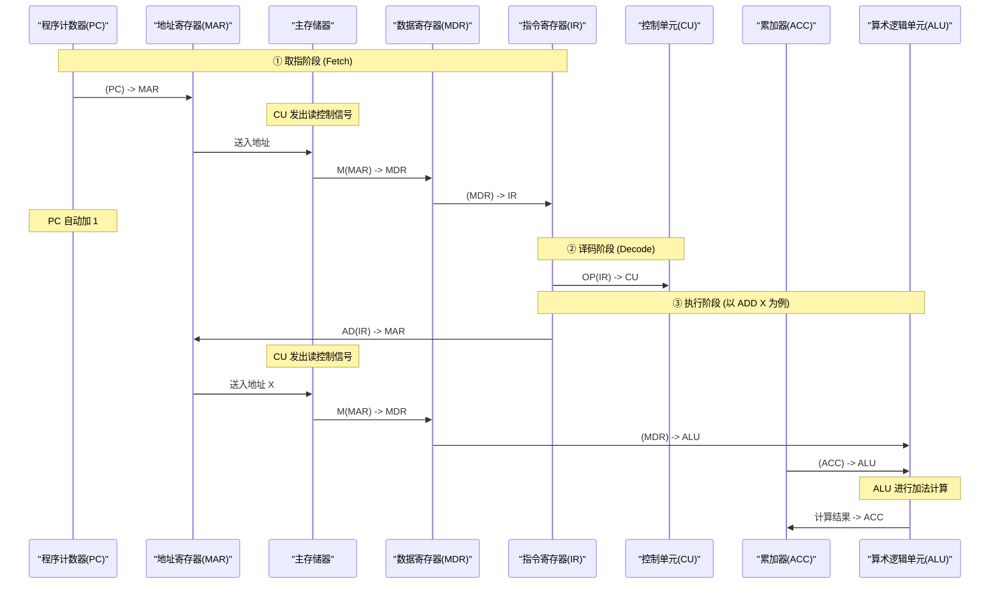

# 指令执行过程

## 定义

指令执行过程是 CPU 从主存储器中取出指令、分析指令（译码）并根据指令的要求完成具体操作（执行）的全过程。

一个完整的**指令周期（Instruction Cycle）**是指 CPU 从主存中取出并执行一条指令的时间。通常由**取指周期**、**间址周期**、**执行周期**和**中断周期**四个机器周期组成。

---

## 硬件交互流转流程 (RTL 描述)

这里以经典的加法指令 `ADD X`（意为：将主存中地址为 $X$ 的数据与当前累加寄存器 $ACC$ 中的数相加，结果存回 $ACC$）为例，展示 CPU 内部各寄存器的精细流转步骤。

### 1. 取指周期（Fetch Cycle）
* **任务**：根据 PC 中的指令地址，从主存中取出指令字并送往指令寄存器 IR。
* **微操作步骤 (RTL)**：
  1. `(PC) -> MAR`：将程序计数器中的内容（指令地址）送入地址寄存器 MAR。
  2. `(MAR) -> Address Bus`，`Read Signal -> Control Bus`：主存控制器进行读操作。
  3. `Data Bus -> MDR`，即 `M(MAR) -> MDR`：从主存读出的指令字送入数据寄存器 MDR。
  4. `(MDR) -> IR`：将 MDR 中的指令字送入指令寄存器 IR。
  5. `(PC) + 1 -> PC`：程序计数器自动加 1（“1”表示一个指令字长，如果是按字节寻址且指令为 32 位，则加 4）。

### 2. 间址周期（Indirect Cycle）
* **任务**：若指令采用间接寻址，则需根据地址码取出操作数的有效地址。
* **微操作步骤 (RTL)**：
  1. `AD(IR) -> MAR`：将指令寄存器中指令的地址码部分送往 MAR。
  2. `M(MAR) -> MDR`：从主存读出有效地址。
  3. `(MDR) -> AD(IR)`：将有效地址送回 IR 的地址码字段（或存入内部暂存器）。

### 3. 执行周期（Execute Cycle）
* **任务**：根据操作码译码出的控制信号，具体完成指令指定的操作。
* **微操作步骤 (RTL - 以典型指令为例)**：
  * **取数指令 `LDA X`**：将主存地址 $X$ 处的数送至累加器 ACC。
    1. `AD(IR) -> MAR`
    2. `M(MAR) -> MDR`
    3. `(MDR) -> ACC`
  * **存数指令 `STA X`**：将 ACC 中的数存入主存地址 $X$ 处。
    1. `AD(IR) -> MAR`
    2. `(ACC) -> MDR`
    3. `(MDR) -> M(MAR)` （向主存写数据）
  * **加法指令 `ADD X`**：将主存地址 $X$ 处的数同 ACC 中的数相加，结果存入 ACC。
    1. `AD(IR) -> MAR`
    2. `M(MAR) -> MDR`
    3. `(MDR) -> ALU`, `(ACC) -> ALU`
    4. `ALU计算结果 -> ACC`

### 4. 中断周期（Interrupt Cycle）
* **任务**：在指令执行完毕后，若有中断请求且满足响应条件，则暂停当前程序，保存断点，并转往中断服务程序。
* **微操作步骤 (RTL)**：
  1. `SP - 1 -> SP`, `(SP) -> MAR`：堆栈指针 SP 减 1（压栈准备），送入 MAR。
  2. `(PC) -> MDR`：将当前 PC 值（断点地址）送入 MDR。
  3. `(MDR) -> M(MAR)`：写入主存（保存断点到堆栈中）。
  4. `中断入口地址 -> PC`：将中断服务程序的入口地址送入 PC，下一周期自动进入中断服务。

---

## 考研重点与题型分析

1. **指令周期各阶段的判别**：
   * 考研常考“CPU 如何在物理上识别当前从内存取出的是指令还是数据”。
   * 答案是：根据**指令周期的不同阶段**。取指周期取出的为指令（送至 IR），执行周期取出的为操作数（送至寄存器/ALU）。
2. **寄存器流转分析（RTL 题）**：
   * 给出一种新指令（例如 `交换指令 XCHG X`），要求写出其在取指、执行等周期的微操作步骤。
   * **做题抓手**：只要涉及访存，必须先通过 `MAR`；从内存读出的数据先存入 `MDR`，写入内存的数据也必须先存入 `MDR`；所有的运算都必须通过 `ALU` 进行。

---

## Connections

- [[计算机系统概述]] — 了解整体硬件结构和性能指标
- [[CPU结构]] — 了解控制器（CU）、ALU 和寄存器组的硬件构成

---

## Sources

- 27王道《计算机组成原理》高清带书签.pdf · 第一章 计算机系统概述
- 计算机组成原理第一章.xmind
